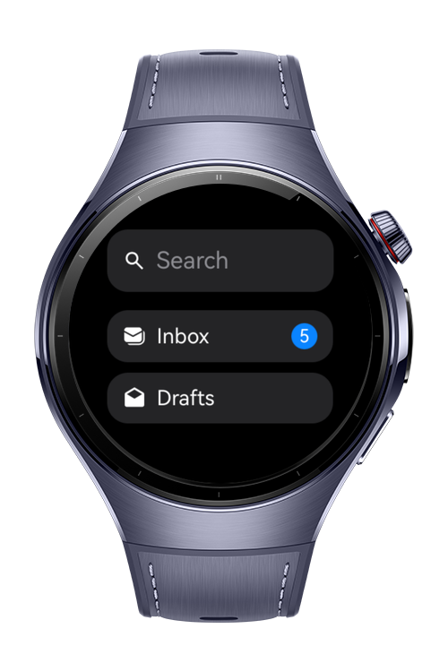
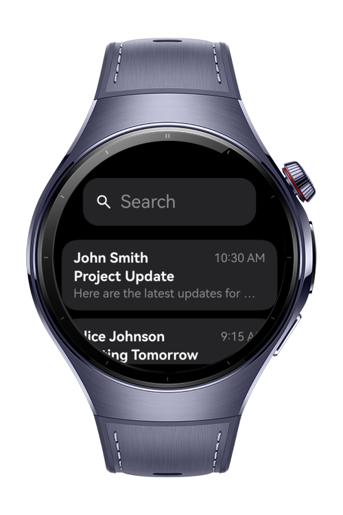
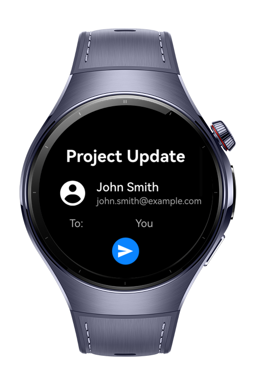

> **Note:** To access all shared projects, get information about environment setup, and view other guides, please visit [Explore-In-HMOS-Wearable Index](https://github.com/Explore-In-HMOS-Wearable/hmos-index).

# MailClient

MailClient is a smartwatch application built with HarmonyOS ArkTS/ArkUI, designed to give users quick and intuitive access to their email on small screens. With a clean interface and simple navigation, MailClient lets you browse folders, view messages, and reply from your wearable device.

# Preview

<div align="left">
  
  
  
  
</div>

# Use Cases
Quickly preview how emails look on a smartwatch. Open and read a single message in a compact format.

# Tech Stack

- **Languages**: ArkTS, Typescript
- **Frameworks**: HarmonyOS SDK 5.0.2(14)
- **Tools**: DevEco Studio Vers 5.1.0.842
- **Libraries**: @kit.ArkUI

# Directory Structure

```
entry/src/main/ets/
|---entryability
|---|---EntryAbility
|---entrybackupability
|---|---EntryBackupAbility
|---model
|---|---Mail
|---|---MailDetail
|---|---MailFolder
|---pages
|---|---HomePage
|---|---Index
|---|---MailDetailPage
|---|---MailListPage
|---util
|---|---NavigationHelper
|---viewmodel
|---|---HomeViewModel
|---|---MailDetailViewModel
|---|---MailListViewModel
```

# Constraints and Restrictions

## Supported Devices

- Huawei Watch 5

# LICENSE

MailClient is distributed under the terms of the MIT License.
See the [LICENSE](/LICENSE) for more information.