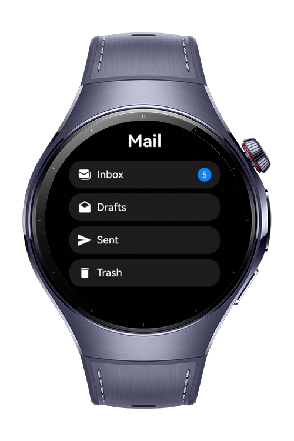
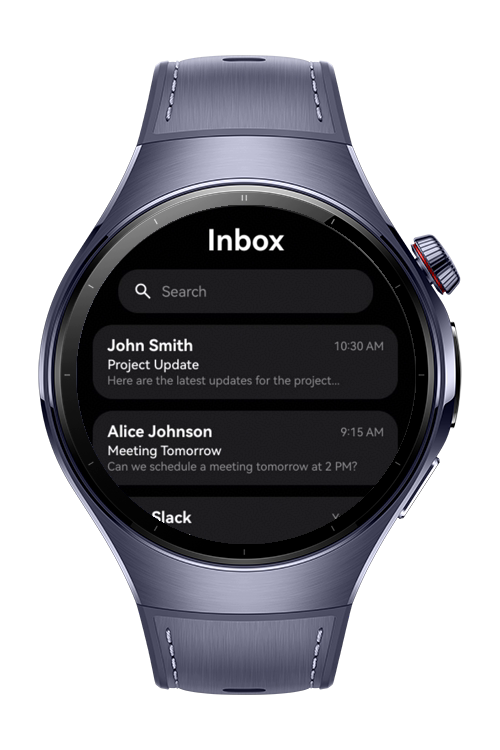
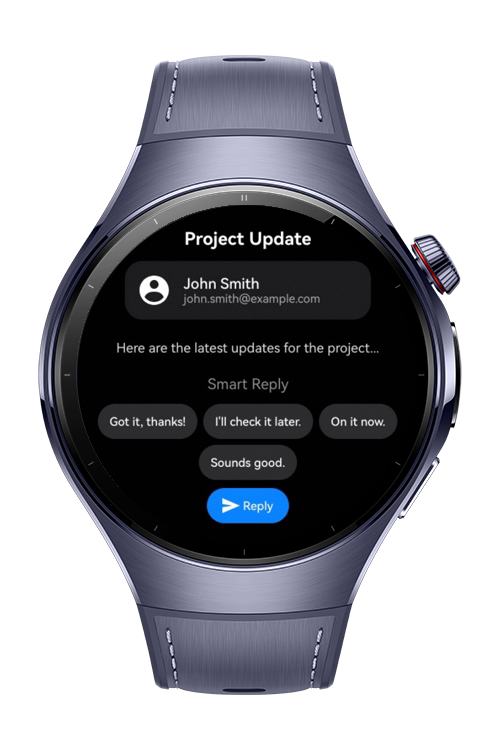
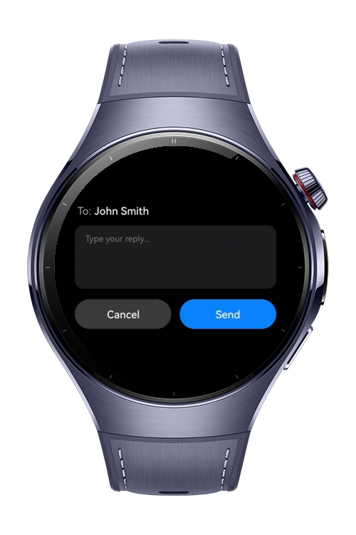

# MailClient

MailClient is a smartwatch application built with HarmonyOS ArkTS/ArkUI, designed to give users quick and intuitive access to their email on small screens. With a clean interface and simple navigation, MailClient lets you browse folders, view messages, and reply from your wearable device.

# Preview

<div align="left">
  
  
  
  
</div>

# Use Cases
- **Compact Wearable UI**: Optimized for circular displays with high-contrast typography and appropriate safe-zone management.
- **Local Persistence**: Integrated with ArkData Preferences to save email states (Trash, Sent) across application restarts.
- **Swipe-to-Action**: Quick access to Delete and Archive actions through intuitive list gestures.
- **Smart Contextual Replies**: One-tap response options for efficient communication on small screens.
- **Haptic Feedback**: Tactile interaction support for a more engaging and responsive user experience.
- **Functional Search**: Real-time email filtering on list pages to quickly find relevant messages.

# Technology

## Stack
- **Languages**: ArkTS, Typescript
- **Frameworks**: HarmonyOS SDK 5.0.2(14)
- **Tools**: DevEco Studio Vers 5.1.0.842
- **Libraries**:
  - @kit.ArkUI
  - @kit.SensorServiceKit'
  - @kit.ArkData

## Required Permissions
- `oohos.permission.VIBRATE`

# Directory Structure

```
entry/src/main/ets/
|---entryability
|---|---EntryAbility
|---entrybackupability
|---|---EntryBackupAbility
|---model
|---|---Mail
|---|---MailDetail
|---|---MailFolder
|---pages
|---|---HomePage
|---|---Index
|---|---MailDetailPage
|---|---MailListPage
|---viewmodel
|---|---HomeViewModel
|---|---MailDetailViewModel
|---|---MailListViewModel
```

# Constraints and Restrictions

## Supported Devices

- Huawei Watch 5

# LICENSE

MailClient is distributed under the terms of the MIT License.
See the [LICENSE](/LICENSE) for more information.